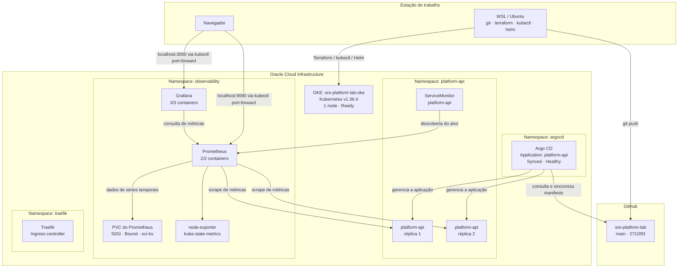

# Topologia do laboratório SRE

Snapshot do ambiente em 8 de outubro de 2026.

## Diagrama

## Componentes

- **Estação local:** WSL/Ubuntu usado para executar Git, Terraform, `kubectl` e Helm.
- **GitHub:** repositório do laboratório; o commit `2711f93` contém o ajuste de recursos e a estratégia `Recreate` do Grafana.
- **OCI / OKE:** cluster `sre-platform-lab-oke`, Kubernetes v1.36.4, com um node `Ready`.
- **Argo CD:** monitora a aplicação `platform-api`, reportada como `Synced` e `Healthy`.
- **Aplicação:** `platform-api`, com duas réplicas e um `ServiceMonitor`.
- **Observabilidade:** Prometheus, Grafana, `node-exporter` e `kube-state-metrics`.
- **Persistência:** PVC do Prometheus com 50Gi, estado `Bound`, usando a StorageClass `oci-bv`.
- **Acesso às interfaces:** `kubectl port-forward` disponibiliza Grafana em `localhost:3000` e Prometheus em `localhost:9090`; esses encaminhamentos são locais e temporários.

## Estado registrado

- Grafana: `3/3 Running`, 0 restarts na última checagem compartilhada.
- Prometheus: `2/2 Running`, 0 restarts na última checagem compartilhada.
- `platform-api`: duas réplicas `Running`; aplicação `Synced` e `Healthy` no Argo CD.
- PVC do Prometheus: `Bound`, 50Gi.
- Git: `main` em `2711f93`, alinhado com `origin/main` na última checagem compartilhada.
